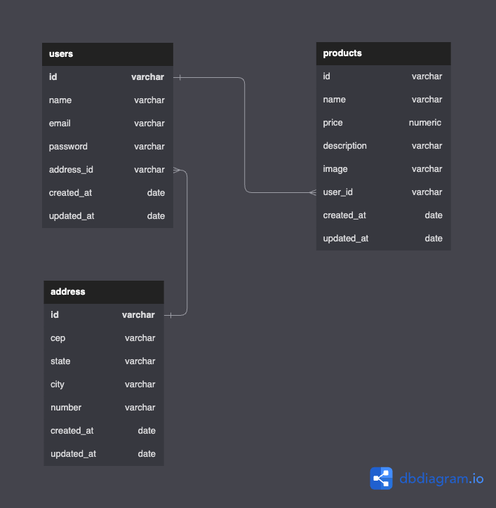

### Escopo do projeto
Esse projeto é uma versão compacta de um CRUD para gestão de usuários e produtos, além de contar com autenticação e proteção de rotas.

O seu objetivo é atender aos requisitos do desafio técnico de Node.js.

### Modelo de dados
Segue uma representação do modelo de dados que foi aplicado ao projeto


### Executar o projeto em ambiente local

#### Ferramentas
As seguintes ferramentas, com suas respectivas versões, foram utilizadas para criar o projeto e serão necessárias para que ele seja executado em ambiente local:
- **Node.js** na versão 16.14
- **Yarn** na versão 1.22
- **Docker** na versão 20.10

#### Passo a passo

##### Aplicação e banco de dados
- A partir do diretório-raiz do projeto, via terminal, execute o seguinte comando para que o *container* do (1) banco de dados e da (2) aplicação sejam criados e iniciados:
   ```shell
   docker-compose up
   ```
   > Caso o *container* da aplicação ou do banco de dados seja pausado após sua criação, da próxima vez que precisar executá-lo(s), basta substituir o "up" por "start" no *script* mencionado no passo anterior
- Também a partir do diretório-raiz do projeto, via terminal, execute as *migrations*, para criação das tabelas, executando o seguinte comando:
    ```shell
    yarn typeorm migration:run
    ```
- Agora, em seu aplicativo `SGBD`, crie uma conexão para o seu `localhost` com o PostgreSQL
  > Segue exemplo de como criar essa conexão a partir do app **Beekeeper Studio**, mas você pode usar qualquer outro Gerenciador, como DBeaver etc.
   - Faça o *download* do Beekeeper Studio e siga o procedimento de instalação referente ao seu sistema operacional
   - Ao abrir a interface primeira vez, selecione que o tipo de conexão a ser criada é "Postgres"
   - Preencha os seguintes campos com as respectivas informações
      - **User**: postgres
      - **Password**: docker
      - **Default Database**: erp_schema
   4. Clique no botão que fica logo abaixo desse formulário, com o título "Test" para validar se a conexão foi devidamente estabelecida
   5. Se tudo correr bem nesse passo, dê um nome para essa conexão no campo "Connection Name" e clique no botão "Save" para registrá-la
- Agora você já conseguirá ver a conexão e, dentro dela, uma pasta com o nome "public"
- Expandindo essa conexão, verá todas as tabelas que foram criadas a partir das *migrations*

##### Importação da Collection
> O aplicativo utilizado para consumir as rotas em ambiente de desenvolvimento foi o **Insomnia**
- Faça o download desse aplicativo e siga as etapas de instalação referente ao seu Sistema Operacional
- Depois de instalado e aberto, no canto inferior esquerdo, clique em "Preferences"
- Selecione a aba "Data"
- Clique no botão "Import"
- Selecione o arquivo e clique em "Scan" e depois "Import"
- No topo do aplicativo, você verá três abas; clique em "Debug" 
- No canto superior esquerdo, certifique-se que o ambiente "dev" esteja selecionado. Se não estiver, o faça
- Logo após a conclusão desse passo, é só começar a consumir a aplicação ;D